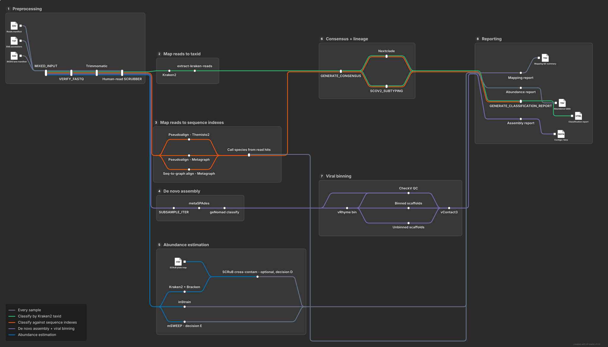

[](https://www.nextflow.io/) [](https://sylabs.io/docs/) 

# Viral Lens

**Viral Lens** (also known as viral-lens) is a bioinformatics pipeline for reconstructing and classifying viral genomes from short-read sequencing data. It was developed for the [RVI project](https://www.sanger.ac.uk/group/respiratory-virus-and-microbiome-initiative/) at the Wellcome Sanger Institute, and has been validated using data generated using the RVI target enrichment protocol.

---
## Contents
- [Pipeline Summary](#pipeline-summary)
- [How to Cite](#how-to-cite)
- [Basic usage](#basic-usagwe)
- [Installation and dependencies](#installation-and-dependencies)
  - [Software](#software)
  - [Containers](#containers)
- [Inputs](#inputs)
  - [Manifest](#manifest)
  - [Kraken2 Database](#kraken2-database)
  - [NextClade config](#nextClade-index-json)
- [Outputs](#outputs)
  - [Primary outputs](#primary-outputs)
  - [Secondary outputs](#secondary-outputs)
  - [De novo assembly + viral binning outputs](#de-novo-assembly--viral-binning-outputs)
- [Configuration](#configuration)
  - [Parameters](#parameters)
  - [Profiles](#profiles)
- [Unit Tests](#unit-tests)
- [Pipeline components documentation](#pipeline-components-documentation)
  - [Processes](#processes)
  - [Workflows](#workflows)
- [rvi_integration_1: work in progress](#rvi_integration_1-work-in-progress)
- [Licence](#licence)

---

## Pipeline Summary

The pipeline takes as input (a) a manifest containing  **fastq pairs file** paths and (b) a **kraken detabase**  (see [Inputs section](#inputs) for more details) and outputs a collection of sequences reconstucted from the reads (using an alignment-and-consensus approach; see below), along with a number of reports. The broad steps followed by the pipeline are as follows:

0. **Preprocessing** (Optional): An optional preprocessing workflow (activated by `--do_preprocessing true`). This remove adapters (via `trimmomatic`), tandem repeats (via `TRF`) and human reads (via `sra-human-scrubber`) from the input fastq files. Each of those steps can be set on/off (`--run_trimmomatic`, `--run_trf`, `--run_hrr`).

1. **Classify Reads and select references**: `kraken2` is initially used to classify the reads in the input fastq, using the input Kraken database. The resulting Kraken2 report is used to select partition the reads into groups, each associated with a selected reference sequence that will be used to guide the reconstruction of the viral genome. 

2. **Generate Consensus**: The reads sets produced in the previous step are aligned to their respective references (via `bwa`
or minimap2), with the resulting pileup being provided to `ivar` to determine the sequence by consensus (in either one or two rounds). 

3. **NextClade analysis**: (Optional) NextClade is run on the resulting viral genomes.

4. **Pangolin analysis**: (Optional) For SARS-CoV-2 genomes, Pangolin is run to sub-type the genome. 

5. **De novo assembly + viral binning** (Optional, activated by `--do_assembly true`): the same preprocessed reads are also assembled de novo (`metaSPAdes`), classified for viral content (`geNomad`), binned into putative genomes (`vRhyme`), quality-checked (`CheckV`) and clustered/taxonomically assigned (`vContact3`) — a parallel lane alongside steps 1-4, not a replacement for them. See [rvi_integration_1: work in progress](#rvi_integration_1-work-in-progress).

The diagram below (rendered with [nf-metro](https://github.com/seqeralabs/nf-metro) from [`docs/nf-metro/route_map.mmd`](docs/nf-metro/route_map.mmd)) shows how these lanes relate — the green line is steps 1-4 above; the purple line is step 5:



[**(&uarr;)**](#contents)
---

## How to Cite

This software will be published soon. Until it is, please provide the URL to this GitHub repository when you use the software in your own work.

[**(&uarr;)**](#contents)
---

## Basic usage

```bash
PIPELINE_CODE=<path to viral lens repo>
MANIFEST=<path to my manifest>
KRAKEN_DB_PATH=<path to my kraken DB>
PIPELINE_CONTAINERS=<path to my containers dir>
NEXTCLADE_INDEX_JSON=<path to my nextclade_index.json>

## nextclade_index_json is optional -- required if Nextclade output is required
nextflow run ${PIPELINE_CODE}/main.nf \
    --manifest ${MANIFEST} \
    --db_path ${KRAKEN_DB_PATH} \
    --nextclade_index_json ${NEXTCLADE_INDEX_JSON} \
    --outdir ./output/ \
    -with-trace -with-report -with-timeline \
    -profile sanger_local \
    -resume
```

[**(&uarr;)**](#contents)

---
## Installation and dependencies

### Software

The following software in required to run the pipeline (with versions used for testing and validation listed):

- Minimal requirements
  - Nextflow = `23.10.1`
  - Python3
    - pytest = `6.2.2`
    - importlib-resources = `5.1.0`
    - flake8 = `7.0.0`
    - pandas = `2.1.4`
    - cached-property = `1.5.2`
    - scipy = `1.12.0`
  - kraken2 = `v2.1.3`
  - Samtools/htslib = `1.21`
  - BWA = `0.7.17`
  - minimap2 = `2.30`
  - iVar = `1.4.3`
  - [kraken2ref](https://github.com/genomic-surveillance/kraken2ref) = `v2.1.0`
- If requiring NextClade analysis
  - NextClade (CLI) = `3.16.0`
- If requiring Pangolin analysis
  - Pangolin `4.3.1`
- When using containers
  - [Singularity](https://docs.sylabs.io/guides/latest/user-guide/) is required to use Singularity Containers, tested on ``ce version 3.11.4``

> NOTE: Running the pipeline under an environment which has the above software installed but with different versions may work, but has not been tested and validated.

### Containers

Out-of-the-box, the pipeline uses containers for these dependencies. Custom container images required by the pipeline have been deposited at quay.io at [quay.io gsu-pipeline](https://quay.io/organization/gsu-pipelines), and the pipeline is configured to use these containers. 

Source code for these can be found in `"$projectDir/containers"`. To build the containers, run the commands bellow.

```bash
cd containers/
sudo singularity build alignment.sif alignmentContainer.sing
sudo singularity build ivar.sif ivarContainer.sing
sudo singularity build pangolin.sif pangolinContainer.sing
sudo singularity build kraken2ref.sif kraken2ref.sing
```

> NOTE: To use local containers on the pipeline set the parameters, you will need to edit `"$projectDir/conf/containers.config"` and change the locations for each container. 

[**(&uarr;)**](#contents)


## Inputs

This pipeline relies on three **main inputs**:

- **`manifest`** : CSV Manifest of input fastq file pairs.
  - Must have `sample_id`,`reads_1` and `reads_2` columns
  - If you have your set of fastq pairs in a single dir, a script (`write_manifest.py`) is provided to facilitate this process.
- **`db_path`** : Path of a valid [kraken2 database](https://github.com/DerrickWood/kraken2/blob/master/docs/MANUAL.markdown#kraken-2-databases)
- **`nextclade_index_json`** : (Optional, if wanting NextClade analysis) Path to a JSON file mapping sequence products from the pipeline to NextClade datasets

### Manifest

The pipeline require as input a manifest containing a unique sample id (`sample_id`) and paths to each of the fastq pair file (`reads_1` and `reads_3`)

```csv
sample_id,reads_1,reads_2
sample1,/path/to/output/sample1_R1.fq,/path/to/output/sample1_R2.fq
sample2,/path/to/output/sample2_R1.fq,/path/to/output/sample2_R2.fq
sample3,/path/to/output/sample3_R1.fq,/path/to/output/sample3_R2.fq
```

> NOTE: The collumn **`sample_id`** must be **unique, alphanumerics (non consecutive "_" are accepted) and cannot be empty**. Pipeline will fail if any of these conditions are not met.

### Kraken2 Database

This pipeline essentially works with a Kraken2 database that has been built from Viral RefSeq in the standard way (e.g. see [here](https://benlangmead.github.io/aws-indexes/k2) for publicly available Kraken3 DBs). However, for respiratory viruses, we have improved the performance of the pipeline using a Kraken2 database that has been prepared in a specific way, namely:

- The Influenza taxonomy is modified below the level of the species such that each segment is represented as its own distinct branch. 
- Further, for specifically segments 4 (HA) and 6 (NA), those branches of the custom taxonomy have an additional level so that nodes representing subtypes H1, H2, H3... are directly below the segment 4 node, and similarly, nodes representing subtypes N1, N2, N3... fall directly under the segment 6 node. Essentially, the segments of the flu genome are considered as distinct sequences for the purposes of the kraken2 classification step
- The number of Influenza, RSV (A and B), Rhinovirus and Metapneumovirus in the database is also expanded as compared to those found in viral RefSeq

An example database prepared in this way can be found [here](https://rvi_kraken2_dbs.cog.sanger.ac.uk/refseq_ncbiFlu_kfv2_20241027.tar.gz). 

A complimentary tool to viral-lens, [vl-kraken-prep](https://github.com/genomic-surveillance/krakenflu), can be used to prepare a Kraken2 database for viral-lens. 

### NextClade index JSON

The index JSON file maps informs the pipeline of the locations of relevent NextClade datasets for the viral genomes it has reconstructed. It is organised by NCBI taxonomy id and segment id (where "ALL" is used as the segment id for monopartite viruses). Here is an example containing configuration for Influenza B (tax id 2955465) and Gammapapillomavirus 11 (tax id 1513256)
```json
{
    "2955465": {
        "1": [
            "/path/to/nextclade_data/data/nextstrain/flu/vic/pb1"
        ],
        "2": [
            "/path/to/nextclade_data/data/nextstrain/flu/vic/pb2"
        ],
        "3": [
            "/path/to/nextclade_data/data/nextstrain/flu/vic/pa"
        ],
        "4": [
            "/path/to/nextclade_data/data/nextstrain/flu/vic/ha/KX058884"
        ],
        "5": [
            "/path/to/nextclade_data/data/nextstrain/flu/vic/np"
        ],
        "6": [
            "/path/to/nextclade_data/data/nextstrain/flu/vic/na/CY073894"
        ],
        "7": [
            "/path/to/nextclade_data/data/nextstrain/flu/vic/mp"
        ],
        "8": [
            "/path/to/nextclade_data/data/nextstrain/flu/vic/ns"
        ]
    },
    "1513256": {
        "ALL": [
            "/path/to/local_data/1513256/GCF_000898855.1",
            "/path/to/local_data/1513256/GCF_000896435.1",
            "/path/to/local_data/1513256/GCF_000908695.1",
            "/path/to/local_data/1513256/GCF_000899695.1"
        ]
    }
}
```

Note in this example that (a) the 8 segments of Influenza B each point to a different data set, and (b) Gammapapillomavirus 11 has 4 datasets (the pipeline will run NextClade against all 4 in this case).

A script is bundled with the pipeline to help with the preparation of this file. Usage:

```bash
python <path/to/viral-lens>/bin/create_index.py /path/to/cloned/github/nextclade_data/data /path/to/local/custom/nextclade/datasets nextstrain,enpen
```

The third positional argument refers to the subdirectories under `path/to/cloned/github/nextclade_data/data` which should be included in the index JSON file.

The expected structure of `/path/to/local/custom/nextclade/datasets` is as follows:
```bash
path/to/local/custom/nextclade/datasets
|--- virus_species_taxID
      |--- assembly_ID
            ├── genome_annotation.gff3
            ├── pathogen.json
            └── reference.fasta
```

[**(&uarr;)**](#contents)

## Outputs

### Primary outputs

The output file tree should look like the tree bellow:

```bash
<output_dir>/
├── summary_report.csv
├── consensus_sequence_properties.json
├── <sample_id>
│   ├── <sample_id>.kraken_report.txt
│   ├── <ref_id>
│   │   ├── <sample_id>.<ref_id>.consensus.fa
│   │   ├── <sample_id>.<ref_id>.properties.json
│   │   ├── <sample_id>.<ref_id>.nextclade.tar.gz
│   │   ├── <sample_id>.<ref_id>.sorted.bam
│   │   └── <sample_id>.<ref_id>.sorted.bam.bai
│   ├── [...]
├── [...]
```

...where <sample_id> is the identifier provided in the manifest, and <ref_id> is the taxonomy ID of the reference sequence used to create the consensus sequence (note: this may often not correspond to a real NCBI taxonomy id, because the custom kraken2 database used by viral-lens will usually contain many "artificial" nodes introduced to represent segments of multi-partite viruses; see above)

#### <sample_id>/<ref_id>/<sample_id>.<ref_id>.consensus.fa

Inferred consensus sequence for reference `ref_id` in sample `sample_id`
 
#### <sample_id>/<ref_id>/<sample_id>.<ref_id>.properties.json

A collection of observed and computed properties for the inferred consensus sequence. 

- `id` 
  - A unique identifier for the consensus sequence across the run (formed from sample id and reference id)  
  - Example: `50213_1_67.8120647`
- `sample_id` 
  - ID of the sample (as provided in the manifest)
  - Example: `50213_1_67`
- `tax_id`  
  - ID of the reference used to build the consensus sequence
  - Example: `8120647`
- `selected_taxid`
  - Tax ID (in the custom database) of the reference used to construct the consensus
  - Example: `8120647`
- `ref_selected` 
  - Description of the reference used to construct the consensus
  - Example: `"A/swine/Guangxi/NS2394/2012(H3N2) segment 4"`
- `reference_length` 
  - Length of the selected reference
- `virus_subtype`
  - Overall subtype of the selected reference
  - Example: `"H3N2"`
- `virus_name`
  - NCBI species name of the selected reference
  - Example: `Alphainfluenzavirus influenzae`
- `report_name`
  - "Common" name for the virus species for reporting
- `virus` 
  - NCBI taxonomy ID of the selected virus (species level node)   
  - Example: `2955291"`
- `sample_subtype`
  - (Where sub-typing has been possible): Inferred sub-type of the sequence
  - Example: `"H3"`
- `flu_segment`
  - (For segmented / multi-partite viruses) Inferred segment number of the consensus sequence
  - Example: `4`
- `longest_non_n_subsequence`
  - Length of the longest stretch of non-N sequence in the consensus 
- `num_reads`
  - Number of read associated with the reference (by kraken2ref) 
- `reads_mapped` 
  - Number of reads successfully mapped back to the consensus
- `reads_unmapped`
  - Number of reads unmapped
- `bases_mapped`
  - Number of bases mapped mapped back to the consensus
- `reads_mapped_in_proper_pairs` 
  - Reads mapped in proper pairs (expected orientation and distance)  
- `positions_exceeding_depth`
  - Histogram containing the number of positions exceeding depths from 0 to 100 
- `percent_positions_exceeding_depth_10` 
  - Percentage of position exceeding depth 10 
- `percent_non_n_bases`
  - Percentage of bases in the final consensus that are non-M
- `mean_depth_per_position`  
  - Total number of mapped positions divided by length of consensus
- `consensus_length`  
  - Length of final consensus sequence
- `nc.selected_dataset`
  - The NextClade dataset used for the nc.qc.* properties. If NextClade was run on multiple datasets, this is the dataset that resulted in the lowest overall score
  - Example: `nextclade_data/data/nextstrain/flu/h3n2/pb1`
- `nc.coverage` 
  - Coverage when aligning the consensus sequence to the reference in the selected NextClade dataset 
  - Example: `0.9726612558735583`
- `nc.qc.{overallScore,overallStaus,missingData,mixedSites,privateMutations,snpClusters,frameShifts,stopCodons}` - 
  - QC Properties from the NextClade analysis using the selected dataset (see NextClade documentation for details)
- `num_nextclade_datasets`  
  - Number of NextClade datasets used for analysis (and correspondingly number of entries in the `nextclade_results` list)
- `nextclade_results` 
  - Full NextClade results (extracted from the JSON file produced by NextClade; see NextClade documentation for details)

Note: the values for all NextClade properties are set to `NextCladeNotRun` if NextClade was not configured to run. 

#### <sample_id>/<ref_id>/<sample_id>.<ref_id>.nextclade.tar.gz

The raw output of NextClade for the consensus sequence. Only present if NextClade was configured to be run (see above). See NextClade documentation for details of the files in this tarball. 

#### <sample_id>/<ref_id>/<sample_id>.<ref_id>.sorted.bam

Result of re-aligning the reads to the final consensus sequence (associated index also included for convenience)

#### <sample_id>/<sample_id>.kraken_report.txt

A `tsv` file sumarizing the number of reads associated to a given item in the taxonomic tree of the kraken database. For more details, check [this file format kraken2 documentation](https://github.com/DerrickWood/kraken2/blob/master/docs/MANUAL.markdown#sample-report-output-format)

  - Here is an example of what the content of this file should look like:

```tsv
81.03	3954901	3954901	U	0	unclassified
18.97	926041	0	R	1	root
18.97	926041	29	D	10239	  Viruses
18.76	915890	0	D1	2559587	    Riboviria
18.76	915890	0	K	2732396	      Orthornavirae
17.42	850471	0	P	2732408	        Pisuviricota
17.42	850445	0	C	2732506	          Pisoniviricetes
17.42	850445	0	O	76804	            Nidovirales
17.42	850445	0	O1	2499399	              Cornidovirineae
17.42	850445	0	F	11118	                Coronaviridae
[...]
```

#### consensus_sequence_properties.json

Collation of all of `<sample_id>/<ref_id>/<sample_id>.<ref_id>.properties.json` files for all consequence sequences in the entire run (for convenience)

#### summary_report.tsv

A csv file with selected properties (per sequence) from the properties.json files above. Note that column names are different fron the JSON property names for legacy / backwards compatibility readsons. Columns:

- Sample_ID (correponds to `sample_id` in JSON)
- Virus_Taxon_ID (`virus` in JSON)
- Virus (`report_name` in JSON)
- Species (`virus_name` in JSON)
- Reference_Taxon_ID (`selected_taxid` in JSON)
- Selected_Reference (`selected_ref` in JSON)
- Flu_Segment (`flu_segment` in JSON)
- Reference_Subtype (`virus_subtype` in JSON)
- Sample_Subtype (`sample_subtype` in JSON)
- Percentage_of_Genome_Covered (`percent_positions_exceeding_depth_10` in JSON)
- Total_Mapped_Reads (`reads_mapped` in JSON)
- Total_Mapped_Bases (`bases_mapped` in JSON)
- Longest_non_N_segment (`longest_non_n_subsequence` in JSON)
- Percentage_non_N_bases (`percent_non_n_bases` in JSON)
- nc.selected_dataset (identical in JSON)
- nc.{coverage,overallScore,overallStatus,missingData,mixedSites,privateMutation,snpClusters,frameShifts,stopCodons} (identical in JSON)
- file_prefix (`id` in JSON)


### Secondary outputs

> If the `--developer_puplish` parameter is set to `true`, the following additional files will appear in the output folder:

```bash
<output_dir>/
├── developer_publish
│   ├── <sample_id>
│   │   └── reads_by_taxon
│   │       ├── <sample_id>_<ref_id>_R1.fq
│   │       ├── <sample_id>_<ref_id>_R2.fq
│   │       ├── [...]
│   │       ├── <sample_id>_decomposed.json
│   │       ├── <sample_id>_pre_report.tsv
│   │       └── <sample_id>_tax_to_reads.json
│   └── reference_files
│       ├── <ref_id>.fa
│       ├── [...]
```

**Kraken Output files** generated by run_kraken process

#### <sample_id>/reads_by_taxon/<sample_id>_decomposed.json 

TBD

#### <sample_id>/reads_by_taxon/<sample_id>_tax_to_reads.json

TBD

#### <sample_id>/reads_by_taxon/<sample_id>_pre_report.tsv

TBD

#### <sample_id>/reads_by_taxon/<sample_id>.<ref_id>_{R1,R2}.fq 

Pair of fastq files containing all reads which were associated to the reference with id `ref_id` n the database.

[**(&uarr;)**](#contents)

### De novo assembly + viral binning outputs

> Only produced if `--do_assembly true` (see [rvi_integration_1: work in progress](#rvi_integration_1-work-in-progress)).

```bash
<output_dir>/
├── assembly_run_summary.json
├── assembly_summary_report.csv
├── vcontact3/
│   ├── final_assignments.csv
│   ├── final_assignments_postprocessed.csv
│   ├── final_assignments_noveltaxa.csv
│   └── postprocess_report.txt
├── <sample_id>/
│   ├── <sample_id>.properties.json
│   ├── metaspades/
│   │   ├── <sample_id>_contigs.fa
│   │   └── <sample_id>_scaffolds.fa
│   ├── genomad/
│   │   ├── <sample_id>_virus_summary.tsv
│   │   ├── <sample_id>_virus.fna
│   │   └── <sample_id>_virus_proteins.faa
│   ├── vrhyme/
│   │   ├── vRhyme_best_bins.*.membership.tsv
│   │   └── vRhyme_best_bins_fasta/
│   └── checkv/
│       ├── virus_scaffolds_quality_summary.tsv
│       └── linked_bins_quality_summary.tsv
├── [...]
```

`<sample_id>.properties.json` for this lane carries the same shape as the taxid
lane's per-consensus properties.json, but with genomad/vrhyme/checkv/vcontact3
sample-level counts (`genomad_n_scaffolds`, `genomad_n_eligible`,
`vrhyme_n_bins`, `vrhyme_n_binned_scaffolds`, `checkv_n_high_quality`,
`checkv_n_medium_quality`, `vcontact3_n_genomes`, `vcontact3_n_clusters`) in
place of consensus/nextclade fields — see main.nf's `count_genomad_summary()` /
`count_vrhyme_membership()` / `count_checkv_quality()` /
`count_vcontact3_for_sample()` for exactly what each counts.
`assembly_run_summary.json` / `assembly_summary_report.csv` collate all
samples' properties.json the same way `consensus_sequence_properties.json` /
`summary_report.tsv` do for the taxid lane.

[**(&uarr;)**](#contents)

## Configuration

### Parameters

The following command-line parameters can be used to modify the behaviour of the pipeline.  

#### Input and output 
- `manifest`: Path to the manifest file 
- `db_path`: Path to the Kraken database.
- `db_library_fa_path` (OPTIONAL): Path to the Kraken database library FASTA file.
  - By default, it assumes there is a `${params.db_path}/library/library.fna`.
- `nextclade_index_json` (OPTIONAL) : JSON file specifiying locations of datasets for nextclade analysis (see later section for how to create this file)
  - If not provided, NextClade analysis will not be performed. 
- `outdir` : folder where output files should be published. By default, it will create a subfolder called `results` in the pipeline launch directory. 

#### Kraken2Ref Handling

- `k2r_fq_load_mode`: Loading mode for Kraken2 fastq files (either `full` or `chunks`).
  - Default: `"full"`.
- `k2r_max_total_reads_per_fq`: Maximum number of reads to process per fastq file.
  - Default: `10,000,000`.

#### Kraken2ref Report Filter

- `min_reads_for_taxid`: Minimum number of reads required to assign a taxonomic ID.
  - Default: `100`.

#### Consensus building Parameters

- `do_consensus_polishing` : "polish" consensus by re-aligning the reads to the initial consensus and re-calling the consensus 
  - Default: `"true"`.
- `read_aligner` : Use bwa or minimap2 for read alignment
  - Default: `"minimap2"`
- `read_aligner_params`: Parameters to supply to the read aligner
  - Default: `"-ax sr -k11 -w 4"` (assumes minimap2)
- `mpileup_max_depth` : max depth for samtools mpileup input to ivar
  - Default: `2000`
- `ivar_initial_min_depth` : minimum depth for initial round of ivar consensus 
  - Default: `1`
- `ivar_initial_freq_threshold` : frequency threshold for initial round of ivar consensus
  - Default: `0.60`
- `ivar_polish_min_depth` : minimum depth for second (final) round of ivar consensus
  - Default: `10`
- `ivar_polish_freq_threshold` : frequency threshold for initial round of ivar consensus
  - Default: `0.75`

#### Virus Subtyping

- `scv2_keyword`: Keyword to identify SARS-CoV-2 sequences. Any taxid name equal to the string set by this parameter will be considered as SCOV2 and subjected to specific SARS-CoV-2 subtyping.
  - Default: `"Severe acute respiratory syndrome coronavirus 2"`.
- `do_scov2_subtyping`: Boolean flag to enable or disable SARS-CoV-2 subtyping via Pangolin.
  - Default: `true`.

#### De novo assembly + viral binning (`--do_assembly`)

Off by default; ported from `rvi-viral-metagenomics-pipeline` (see
[rvi_integration_1: work in progress](#rvi_integration_1-work-in-progress)).
Requires three reference databases with no bundled default — the pipeline will
fail validation if `--do_assembly true` is set without all three:

- `genomad_db`: path to a [geNomad](https://github.com/apcamargo/genomad) database.
- `checkv_db`: path to a [CheckV](https://bitbucket.org/berkeleylab/checkv/) reference database.
- `vcontact3_db_path` (+ `vcontact3_db_version`, `vcontact3_db_domain`): path to a
  [vContact3](https://bitbucket.org/MAVERICLab/vcontact3) reference database.

Everything else has a default carried over from the source pipeline unchanged:
`metaspades_base_mem_gb`, `metaspades_subsample_limit`,
`vrhyme_min_scaffold_length`, `vrhyme_bowtie_threads`,
`vrhyme_pool_min_identity`, `vrhyme_pool_min_aligned_length`, `vrhyme_link_n`,
`vcontact3_postprocess_min_proteins`, `vcontact3_postprocess_max_proteins`,
`subsample_iterations`, `subsample_seed` — see `nextflow.config` and
`nextflow_schema.json` for their values, or `rvi-viral-metagenomics-pipeline`'s
`rvi_toolbox/subworkflows/{assemble,genomad,checkv,vrhyme,vcontact3}.json` for
the per-parameter rationale.

### Profiles

The pipeline is bundled with a pre-defined computation profile, `sanger_standard`. This has been crafted for use on the Wellcome Sanger Institute's HPC infrastructure. A `standard` profile for use with Singularity has also been provided, but has not been tested.  User should consider writing a profile that is compatible with their own compute infrastructure (see [profiles Nextflow documentation](https://www.nextflow.io/docs/latest/config.html#config-profiles) for more details),

[**(&uarr;)**](#contents)

---

## Unit Tests

The workflow & process unit tests for this pipeline are written in the [nf-test](https://www.nf-test.com/) (`v0.8.4`) Nextflow testing framework.

[**(&uarr;)**](#contents)

---
## Pipeline components documentation

### Processes

##### run_kraken

Executes Kraken2 on paired-end FASTQ files, producing outputs that include the classification results, classified and unclassified reads, and a summary report.

##### run_k2r_sort_reads

This process runs Kraken2Ref to parse Kraken reports and sort reads by taxonomic classification. It generates JSON files that map taxonomic IDs to read IDs and performs sorting based on the decomposed taxonomy tree if available.

##### run_k2r_dump_fastqs_and_pre_report

Extract classified reads into FASTQ files and generate a preliminary report based on the taxonomic classification data. It processes classified reads and produces a detailed report for further analysis.

##### concatenate_fqs_parts
This process concatenates FASTQ files from multiple parts into final combined FASTQ files for each taxonomic classification. This process ensures that all parts corresponding to the same taxonomic ID are merged into single files.

##### get_taxid_references

Retrieves sequences for a given taxid from a source FASTA file and indexes them for further analysis.

##### run_aligner

Mapping sequencing reads to a reference genome using BWA or minimap2, followed by post-processing steps including conversion to BAM format, sorting, and indexing. 

##### run_ivar

Generates a consensus sequence from a sorted BAM file using samtools mpileup and ivar consensus.

##### run_pangolin

The process runs the Pangolin tool on a consensus FASTA file to determine the SARS-CoV-2 lineage and extracts relevant metadata from the output.

##### run_qc_script

This process runs a QC analysis on the input BAM, FASTA, and reference files, outputting QC metrics.

##### run_nextclade

This process runs nextClade on the reconstructed sequences, recording the results in JSON (see outputs section)

[**(&uarr;)**](#contents)

### Sub-workflows

#### SORT_READS_BY_REF

The SORT_READS_BY_REF workflow processes paired-end sequencing reads by sorting them according to taxonomic classifications obtained from Kraken2. This workflow uses a manifest file to process multiple samples and produces sorted by taxid FASTQ files for each sample and classification reports.

#### GENERATE_CONSENSUS

The `GENERATE_CONSENSUS` workflow performs read alignment and consensus sequence generation for sequencing data. It processes paired-end reads by aligning them to reference genomes using BWA, followed by consensus calling with iVar. This workflow is designed to take in sequencing data for different samples and taxonomic IDs, process them, and produce consensus sequences.

#### COMPUTE_QC_METRICS

The `COMPUTE_QC_METRICS` workflow is designed to compute quality control (QC) metrics for consensus sequences generated from sequencing data. The workflow processes each sample's data to evaluate the quality and coverage of the generated consensus sequences. The QC metrics include the percentage of bases covered, the percentage of N bases, the longest segment without N bases, and read alignment statistics (total reads aligned, unmapped and mapped).

#### SCOV2_SUBTYPING

The `SCOV2_SUBTYPING` workflow is designed to determine the SARS-CoV-2 lineage (subtype) of consensus sequences using the PANGOLIN tool. This workflow takes in a channel of consensus sequences along with their metadata, runs the PANGOLIN lineage classification, and outputs updated metadata with the assigned lineage.

#### GENERATE_CLASSIFICATION_REPORT

The `GENERATE_CLASSIFICATION_REPORT` workflow generates a classification report based on metadata associated with sequencing samples. This workflow collects metadata from each sample, formats the data into a report line, and aggregates these lines into a final classification report file. A report file with filtered out sequences is written as well.

#### RUN_NEXTCLADE

The `RUN_NEXCLADE` workflow generate QC metrics for sequences supported by a dataset (path set by `nextclade_data_dir` parameter) which provides a **reference FASTA**, a **GFF3 annotation** and (optionally) a **tree JSON** following the directory structure bellow:

If `nextclade_index_json` is not provided, this workflow will not run.

#### ASSEMBLE_META

De novo assembles preprocessed reads with `metaSPAdes`, subsampling first (`SUBSAMPLE_ITER`) if a sample is above `metaspades_subsample_limit`. Only runs if `--do_assembly true`.

#### GENOMAD_CLASSIFY

Runs `geNomad` on each sample's metaSPAdes scaffolds to identify viral sequences, emitting per-sample virus summary/FASTA/protein files consumed by every downstream step in this lane.

#### VRHYME_BIN

Bins viral scaffolds into putative genomes with `vRhyme`, using a pooled cross-sample coverage signal (every qualifying sample's scaffolds are pooled into one bowtie2 index so coverage covariance across the whole batch informs each sample's own binning) — the one step in this lane that isn't purely per-sample. Guarantees a real (possibly empty) `membership.tsv` and bins directory for every sample, so downstream steps never need to special-case "no bins".

#### CHECKV_QC

Runs `CheckV` on both geNomad's raw virus scaffolds and vRhyme's linked bins, producing the quality calls `VCONTACT3_RUN` uses to promote high/medium-quality binned scaffolds to standalone genomes alongside their bin.

#### VCONTACT3_RUN

Per-sample, reconciles vRhyme's binned scaffolds and geNomad's unbinned scaffolds (`vcontact3_prep.py`) into one vContact3-shaped input; pipeline-level, runs `vContact3` once across every sample's combined input, then post-processes the taxonomy calls (`vcontact3_postprocess.py`) to flag/correct out-of-range and realm-conflicting novel-genus predictions.

#### GENERATE_ASSEMBLY_REPORT

Writes the per-sample + run-level report for this lane, straight from `meta` — no separate qc/nextclade JSON to merge in, unlike `GENERATE_CLASSIFICATION_REPORT`. See [De novo assembly + viral binning outputs](#de-novo-assembly--viral-binning-outputs).

#### GENERATE_MAPPING_REPORT / GENERATE_ABUNDANCE_REPORT

Same shape as `GENERATE_ASSEMBLY_REPORT`, built and covered by their own nf-test workflow tests, but not yet called from `main.nf` — their upstream lanes (map-to-sequence-indexes, SCRuB + abundance estimation) aren't ported yet. See [rvi_integration_1: work in progress](#rvi_integration_1-work-in-progress).

---

## rvi_integration_1: work in progress

This branch is porting `rvi-viral-metagenomics-pipeline` functionality into viral-lens; the [route map](docs/nf-metro/route_map.svg) tracks the target shape and [`docs/nf-metro/README.md`](docs/nf-metro/README.md) explains how to regenerate/extend it. Landed so far: the de novo assembly + viral binning lane (`--do_assembly`) and its report, fanning into a shared Reporting section alongside the existing classification report.

The assembly lane has now been **run for real on the farm** (LSF + singularity, real
geNomad/CheckV/vContact3/kraken2 databases) and completes end to end. Fixes that first
real run forced out, all of which only a real execution could have surfaced:

- manifest reads reached `ASSEMBLE_META` as strings, so `R1.countFastq()` threw;
- none of the lane's 15 processes were opted into LSF under `sanger_standard`, so they
  would have run on the submit host;
- `count_vrhyme_membership()` reported the bin count twice, because Groovy's
  `List.unique()` de-duplicates in place;
- vContact3's `--db-version` defaulted to a version that exists in no deployed database,
  and its post-processing step looked for the genome report outside the versioned
  database directory;
- `bowtie2_samtools_only_abundance_estimation` was referenced but never declared.

### Output layout

Per-sample outputs are grouped by lane, not by tool:

```
<outdir>/
  <sample_id>/
    mapping/                  # taxid lane
      <taxid>/                # consensus, bam, per-taxid properties json
      <sample_id>.kraken_report.txt
    assembly/                 # --do_assembly only
      metaspades/
      genomad/
      binning/
        vrhyme/
        checkv/
    sequenceindex/            # --do_sequence_index (--run_msweep and/or --run_metagraph_align)
      msweep/                 # mSWEEP abundances + probs
      msweep_map/             # breadth-of-coverage validation table
      metagraph_hits/         # per-species read-hit counts + provisional calls
      metagraph_map/          # breadth-of-coverage validation table
    abundance/                # reserved: abundance estimation lane
    reports/                  # per-sample lane report json
  vcontact3/                  # run-level: vContact3 runs once per batch
  summary_report.csv, assembly_summary_report.csv, ...
```

Everything publishes under `--outdir`. The ported modules originally used
`params.results_dir` (an `rvi_toolbox` default viral-lens does not declare), which split
outputs across two trees; they now all use `params.outdir`.

`abundance/` is a placeholder for the lane below and is not created until it lands.

The Themisto2 lane's reference-data defaults point at
`/data/pam/software/themisto2/viromeindex/1.0/`, confirmed against real files on the farm.
Its `msweep_map_reference_fasta` must stay positionally aligned with `msweep_ref_groups`
(record N == line N); both currently hold 1321608 entries. The Metagraph lane's reference
data has no default and is unverified — see the bullet above.

> **Note on resources:** `sanger_standard` caps `max_time` at 6h, so the lane's `time_12`
> labels are clamped by `check_max`. That is fine at test scale; geNomad and vContact3 on
> production-sized input may need that cap raised.

Not yet landed, in rough dependency order:

- **Map reads to sequence indexes** lane — the Themisto2/mSWEEP method has **landed and been verified on the farm** (`--do_sequence_index true --run_msweep true`). Sequence-to-graph alignment via Metagraph has **landed but only DSL-dry-run-checked, not run for real** (`--run_metagraph_align true`, plus `metagraph_align_graph`/`metagraph_align_annotation`/`metagraph_align_annotation_seqs`/`metagraph_map_reference_fasta`, all `null` by default and unverified on real HPC paths — `rvi_toolbox`'s own `metagraph_align.config` suggests starting from eu1's personal scratch under `/lustre/scratch126/pam/projects/rvidata/personal/eu1/metagraph/bigviralindex-rvdbc/`, unconfirmed whether that still exists). Both methods feed one `GENERATE_MAPPING_REPORT.nf` call — see `main.nf`'s `if (params.do_sequence_index)` block. Still outstanding: pseudoalignment via Metagraph, which is not a real module anywhere upstream. Each method gets its own boolean flag rather than sharing a method string, so they can be enabled independently.
- **Abundance estimation** lane (Kraken2+Bracken, optionally SCRuB cross-contamination decontamination, `ABUNDANCE_ESTIMATION`) — `GENERATE_ABUNDANCE_REPORT.nf` exists and is tested standalone, waiting on this lane.
- **Wider input handling** — ENA download and iRODS retrieval (`MIXED_INPUT`), beyond today's single local-manifest `parse_mnf()`.
- **`rvi_toolbox` fork reconciliation** — viral-lens's submodule tracks `rvi/rvi_toolbox.git`, 51+ commits behind that fork's own master at time of writing (missing vRhyme/vContact3/geNomad work already merged there); the SCRuB and Metagraph subworkflows this plan depends on exist only on a *different* fork (`eu1/rvi_toolbox.git`, merged to its master). This pass avoided the submodule entirely (see "Port de novo assembly + viral binning lane" commit) precisely because that reconciliation hasn't happened yet.
- **Per-scaffold meta granularity** — today's assembly report counts are sample-level (`genomad_n_scaffolds`, `vrhyme_n_bins`, etc.); one report row per scaffold, carrying that scaffold's own bin/quality/cluster assignment, is a deliberately deferred stretch goal, not a decision made against it.

---

## Licence

[GPL-3](https://www.gnu.org/licenses/gpl-3.0.en.html)

[**(&uarr;)**](#contents)